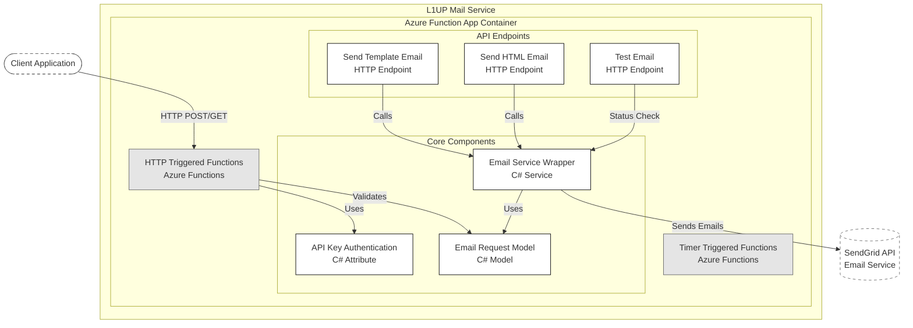

# API Documentation for Legal1Up Mail Service

## Endpoints

### 1. Test Email
- **Method**: GET
- **Endpoint**: `/api/TestEmail`
- **Description**: Simple endpoint to verify if the email service is running.
- **Response Example**:
```json
{
    "success": true,
    "message": "Email service is running"
}
```

### 2. Send HTML Email
- **Method**: POST
- **Endpoint**: `/api/SendHTMLEmail`
- **Description**: Sends an HTML formatted email with optional attachments and CC recipients.

**Request Body Example**:
```json
{
  "fromEmail": "emifragon13@gmail.com",
  "fromName": "Emi",
  "to": [
    {
      "email": "emifragon13@gmail.com",
      "name": "emi"
    }
  ],
  "cc": [
    {
      "email": "angel.moreno@iteso.mx",
      "name": "CC Recipient 1"
    }
  ],
  "subject": "Your deliverable is ready!!",
  "body": "<h1>Test Email</h1><p>This is a test email</p>",
  "replyToEmail": "emifragon13@gmail.com",
  "replyToName": "ReplyTo"
}
```


**Field Descriptions**:
- 
***Required Fields***


* fromEmail: Email address of the sender
* fromName: Display name of the sender
* to: Array of recipients
  * email: Recipient's email address
  * name: Recipient's display name
* subject: Email subject line
* body: HTML content of the email (required)

***Required Fields***


* cc: Array of CC recipients
  * email: Recipient's email address
  * name: Recipient's display name
* replyToEmail: Email address for replies
* replyToName: Display name for reply-to address
* attachments: Array of file attachments
  * fileName: Name of the file (required)
  * base64Content: Base64 encoded file content (required)
  * contentType: MIME type of the file (optional, defaults to "application/octet-stream")

### 3. Send Template Email
- **Method**: POST
- **Endpoint**: `/api/SendTemplateEmail`
- **Description**: Sends an email using a SendGrid template.

**Request Body Example**:
```json
{
  "fromEmail": "emifragon13@gmail.com",
  "fromName": "Emi",
  "to": [
    {
      "email": "recipient@example.com",
      "name": "Recipient"
    }
  ],
  "cc": [
    {
      "email": "angel.moreno@iteso.mx",
      "name": "CC Recipient 1"
    }
  ],
  "templateId": "d-xxxxxxxxxxxxxxxxxxxxx",
  "templateData": {
    "name": "John",
    "confirmationUrl": "https://example.com/confirm"
  }
}
```

**Field Descriptions**:
- 
***Required Fields***


* fromEmail: Email address of the sender
* fromName: Display name of the sender
* to: Array of recipients
  * email: Recipient's email address
  * name: Recipient's display name
* templateId: SendGrid template ID (required)
* templateData: Object containing template variables (required)


***Required Fields***


* cc: Array of CC recipients
  * email: Recipient's email address
  * name: Recipient's display name
* replyToEmail: Email address for replies
* replyToName: Display name for reply-to address
* attachments: Array of file attachments
  * fileName: Name of the file (required)
  * base64Content: Base64 encoded file content (required)
  * contentType: MIME type of the file (optional, defaults to "application/octet-stream")


**Common Response Format**:
```json
{
    "success": true,
    "message": "Email sent successfully"
}
```
or in case of error:
```json
{
    "success": false,
    "error": "Error message details"
}
```

# Timer Triggered Email Functions Documentation

## Overview
The service includes automated email functions that run on scheduled intervals using Azure Functions timer triggers.

## Functions

### 1. Weekly Email Trigger
- **Schedule**: Every Tuesday at 9:00 AM (`0 0 9 * * TUE`)
- **Function Name**: `WeeklyEmailTrigger`
- **Description**: Sends automated weekly reports via email.

**Email Configuration Example**:
```json
{
  "fromEmail": "your-email@domain.com",
  "fromName": "Weekly Automated Email",
  "to": [
    {
      "email": "recipient@domain.com",
      "name": "Recipient Name"
    }
  ],
  "subject": "Weekly Automated Email",
  "body": "<h1>Weekly Report</h1><p>This is your weekly automated email.</p>"
}
```

### 2. Monthly Email Trigger
- **Schedule**: 2nd day of every month at 9:00 AM (`0 0 9 2 * *`)
- **Function Name**: `MonthlyEmailTrigger`
- **Description**: Sends automated monthly reports via email.

**Email Configuration Example**:
```json
{
  "fromEmail": "your-email@domain.com",
  "fromName": "Monthly Automated Email",
  "to": [
    {
      "email": "recipient@domain.com",
      "name": "Recipient Name"
    }
  ],
  "subject": "Monthly Automated Email",
  "body": "<h1>Monthly Report</h1><p>This is your monthly automated email.</p>"
}
```

## Error Handling
Both triggers include error handling that:
- Validates email sending success
- Throws exceptions with detailed error messages
- Logs failures for monitoring

## Implementation Details
- Uses the same SendEmailWrapper service as the HTTP endpoints
- Supports HTML formatted content
- Can be configured for different recipient lists
- Customizable email templates and content

## CRON Expressions Explained
- Weekly trigger: `0 0 9 * * TUE`
  - `0`: At 0 minutes
  - `0`: At hour 0
  - `9`: At 9 AM
  - `*`: Any day of month
  - `*`: Any month
  - `TUE`: On Tuesday

- Monthly trigger: `0 0 9 2 * *`
  - `0`: At 0 minutes
  - `0`: At hour 0
  - `9`: At 9 AM
  - `2`: On the 2nd day
  - `*`: Of every month
  - `*`: Any day of week


# Workflow Diagram

