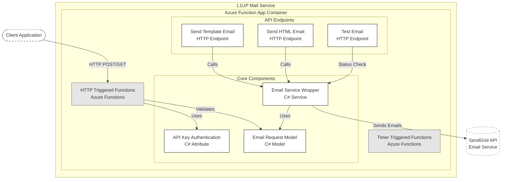

```mermaid
graph TB
    %% External Users/Systems
    Client(["Client Application"])
    SendGrid[("SendGrid API<br>Email Service")]

    subgraph "L1UP Mail Service"
        subgraph "Azure Function App Container"
            direction TB
            APIEndpoints["HTTP Triggered Functions<br>Azure Functions"]
            TimerTriggers["Timer Triggered Functions<br>Azure Functions"]
            
            subgraph "Core Components"
                EmailWrapper["Email Service Wrapper<br>C# Service"]
                AuthHandler["API Key Authentication<br>C# Attribute"]
                EmailModel["Email Request Model<br>C# Model"]
            end

            subgraph "API Endpoints"
                SendTemplate["Send Template Email<br>HTTP Endpoint"]
                SendHTML["Send HTML Email<br>HTTP Endpoint"]
                TestEndpoint["Test Email<br>HTTP Endpoint"]
            end
        end
    end

    %% Relationships
    Client -->|"HTTP POST/GET"| APIEndpoints
    APIEndpoints -->|"Uses"| AuthHandler
    APIEndpoints -->|"Validates"| EmailModel
    
    SendTemplate -->|"Calls"| EmailWrapper
    SendHTML -->|"Calls"| EmailWrapper
    TestEndpoint -->|"Status Check"| EmailWrapper
    
    EmailWrapper -->|"Sends Emails"| SendGrid
    EmailWrapper -->|"Uses"| EmailModel

    %% Styling
    classDef container fill:#e5e5e5,stroke:#666
    classDef component fill:#fff,stroke:#000
    classDef external fill:#fff,stroke:#666,stroke-dasharray: 5 5
    
    class Client,SendGrid external
    class APIEndpoints,TimerTriggers container
    class EmailWrapper,AuthHandler,EmailModel,SendTemplate,SendHTML,TestEndpoint component
```